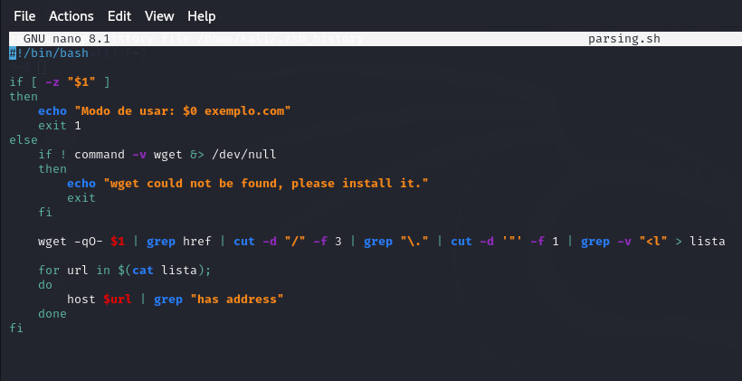
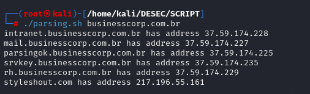

# Parsing para extração de subdomínios de um site e consulta seus endereços IP associados

## Código Script

``` Bash
#!/bin/bash

if [ -z "$1" ]
then
    echo "Modo de usar: $0 exemplo.com"
    exit 1
else
    if ! command -v wget &> /dev/null
    then
        echo "wget could not be found, please install it."
        exit
    fi

    wget -qO- $1 | grep href | cut -d "/" -f 3 | grep "\." | cut -d '"' -f 1 | grep -v "<l" > lista

    for url in $(cat lista);
    do
        host $url | grep "has address"
    done
fi

```
## Script



## Saída

